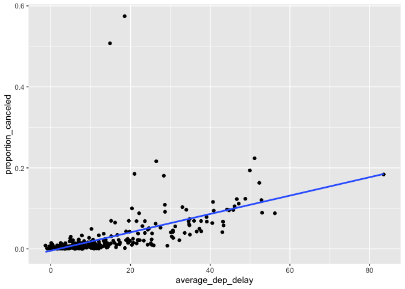

HW1
================
2022-09-24

## How many flights have a missing dep_time? What other variables are missing? What might these rows represent?

``` r
library(dplyr)
```

    ## 
    ## Attaching package: 'dplyr'

    ## The following objects are masked from 'package:stats':
    ## 
    ##     filter, lag

    ## The following objects are masked from 'package:base':
    ## 
    ##     intersect, setdiff, setequal, union

``` r
library(nycflights13)
library(ggplot2)
flights %>%
  mutate(missing_dep_time = if_else(condition= is.na(dep_time),
                                    true=T,
                                    false=F)) %>%
  summarize(flights_missing_dep_time = sum(missing_dep_time))
```

    ## # A tibble: 1 x 1
    ##   flights_missing_dep_time
    ##                      <int>
    ## 1                     8255

``` r
filter(flights, is.na(dep_time))
```

    ## # A tibble: 8,255 x 19
    ##     year month   day dep_time sched_dep_time dep_delay arr_time sched_arr_time
    ##    <int> <int> <int>    <int>          <int>     <dbl>    <int>          <int>
    ##  1  2013     1     1       NA           1630        NA       NA           1815
    ##  2  2013     1     1       NA           1935        NA       NA           2240
    ##  3  2013     1     1       NA           1500        NA       NA           1825
    ##  4  2013     1     1       NA            600        NA       NA            901
    ##  5  2013     1     2       NA           1540        NA       NA           1747
    ##  6  2013     1     2       NA           1620        NA       NA           1746
    ##  7  2013     1     2       NA           1355        NA       NA           1459
    ##  8  2013     1     2       NA           1420        NA       NA           1644
    ##  9  2013     1     2       NA           1321        NA       NA           1536
    ## 10  2013     1     2       NA           1545        NA       NA           1910
    ## # … with 8,245 more rows, and 11 more variables: arr_delay <dbl>,
    ## #   carrier <chr>, flight <int>, tailnum <chr>, origin <chr>, dest <chr>,
    ## #   air_time <dbl>, distance <dbl>, hour <dbl>, minute <dbl>, time_hour <dttm>

``` r
#Missing dep_delay, arr_time, arr_delay, air_time, perhaps represent canceled flights.
```

\##Currently dep_time and sched_dep_time are convenient to look at, but
hard to compute with because they’re not really continuous numbers.
Convert them to a more convenient representation of number of minutes
since midnight.

``` r
flights %>%
  mutate(dep_time = as.integer(dep_time/100) * 60 + dep_time%%100,
         sched_dep_time = as.integer(sched_dep_time/100) * 60 + sched_dep_time%%100)
```

    ## # A tibble: 336,776 x 19
    ##     year month   day dep_time sched_dep_time dep_delay arr_time sched_arr_time
    ##    <int> <int> <int>    <dbl>          <dbl>     <dbl>    <int>          <int>
    ##  1  2013     1     1      317            315         2      830            819
    ##  2  2013     1     1      333            329         4      850            830
    ##  3  2013     1     1      342            340         2      923            850
    ##  4  2013     1     1      344            345        -1     1004           1022
    ##  5  2013     1     1      354            360        -6      812            837
    ##  6  2013     1     1      354            358        -4      740            728
    ##  7  2013     1     1      355            360        -5      913            854
    ##  8  2013     1     1      357            360        -3      709            723
    ##  9  2013     1     1      357            360        -3      838            846
    ## 10  2013     1     1      358            360        -2      753            745
    ## # … with 336,766 more rows, and 11 more variables: arr_delay <dbl>,
    ## #   carrier <chr>, flight <int>, tailnum <chr>, origin <chr>, dest <chr>,
    ## #   air_time <dbl>, distance <dbl>, hour <dbl>, minute <dbl>, time_hour <dttm>

\##Look at the number of canceled flights per day. Is there a pattern?
Is the proportion of canceled flights related to the average delay? Use
multiple dyplr operations, all on one line, concluding with
ggplot(aes(x= ,y=)) + geom_point()

``` r
flights %>%
  group_by(month, day) %>%
  summarize(average_dep_delay = mean(dep_delay,na.rm=TRUE),
                                     proportion_canceled  = sum(is.na(dep_time)/n())) %>%
  ggplot(mapping = aes(x = average_dep_delay, y = proportion_canceled)) +
  geom_point() +
  geom_smooth(method = 'lm', se = FALSE)
```

    ## `summarise()` has grouped output by 'month'. You can override using the `.groups` argument.

    ## `geom_smooth()` using formula 'y ~ x'

<!-- -->

``` r
  #Yes they are related. More canceled flights leads to more delay.
```
